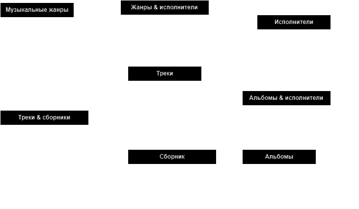

# [Домашнее задание к лекции «Работа с SQL. Создание БД»](https://github.com/netology-code/py-homeworks-db/tree/SQLPY-76/02-creation)

* [x] Cхематическая отрисовка спроектированной базы данных    
  

* [x] Прописанные [SQL-запросы](hwdb.sql), формирующие данную базу данных