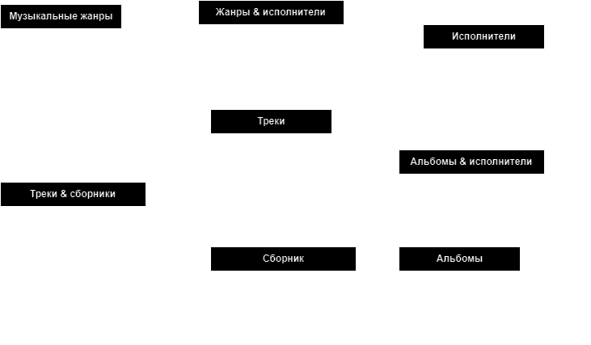
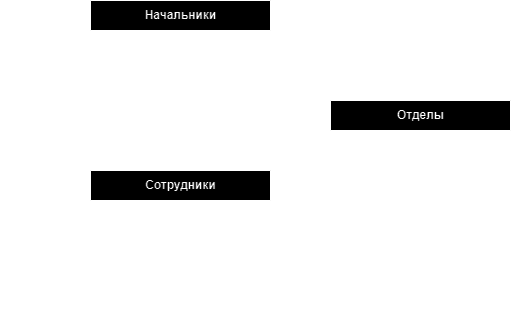

## [Домашнее задание к лекции «Продвинутая выборка данных»](https://github.com/netology-code/py-homeworks-db/tree/SQLPY-76/04-dml)
* [INSERT-запросы](INSERT.sql)
* [SELECT-запросы](SELECT.sql)
---
## [Домашнее задание к лекции «Работа с SQL. Создание БД»](https://github.com/netology-code/py-homeworks-db/tree/SQLPY-76/02-creation)
* Прописанные [CREATE-запросы](CREATE.sql), формирующие музыкальную базу данных
* Cхематическая отрисовка спроектированной музыкальной базы данных    
  

---
### [Дополнительное задание](https://github.com/netology-code/py-homeworks-db/tree/SQLPY-76/02-creation)

* Прописанные [CREATE-запросы](secondary_task.sql), формирующие отношения внутри предприятия    
* Cхематическая отрисовка спроектированных отношений внутри предприятия    
  

